# 2D C-Type Airfoil Mesh Generation

This project focuses on the generation of high-quality 2D C-type meshes for airfoil geometries, starting from a given airfoil contour and using as few user-defined parameters as possible. The generated meshes are designed such that a depth-extruded version is suitable for Delayed Detached Eddy Simulation (DDES) ([meshing guideline](https://www.aiaa-dpw.org/ref/gridding_guidelines_v3_07012024.pdf)).

**Background and Reference**:
- [pyAero](https://github.com/chiefenne/PyAero); the package was evaluated as a reference. Although, it implements many of the required features; however, initial tests revealed the following issues:
  - loading the contour data is not very robust
  - the implementation can't deal with contours that already come with a trailing edge
  - the contour refinement is not smooth enough for DDES-type simulations; the algorithms introduces 1.5-ratio jumps in the cell edge length along the contour

The current implementation addresses the above limitations through the following:

- Handling contours blunt trailing edge, by replacing it with a smooth curve.
- A smooth point-distribution algorithm for the airfoil surface based on:
  - mesh-size ratio,
  - weighting functions to concentrate mesh points in regions of interest (e.g. leading edge or shock buffet regions).

**Mesh topology**:

The mesh is generated using a hybrid structured–unstructured strategy:

- Structured mesh blocks are created in critical regions:
  - the airfoil boundary layer,
  - buffet region.
- The remaining domain is filled with **unstructured triangular elements**, generated using the [Gmsh](https://github.com/live-clones/gmsh/tree/master) library.
Options are provided to make the wake region finer.  

<p align="center">
  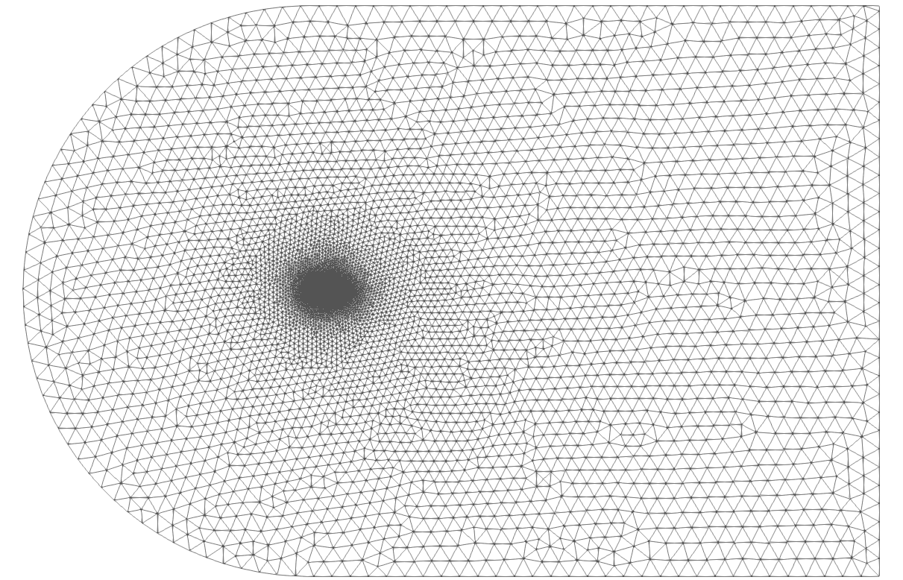
</p>
<p align="center">
  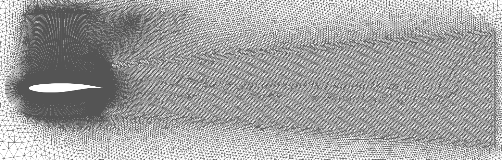
</p>
<p align="center">
  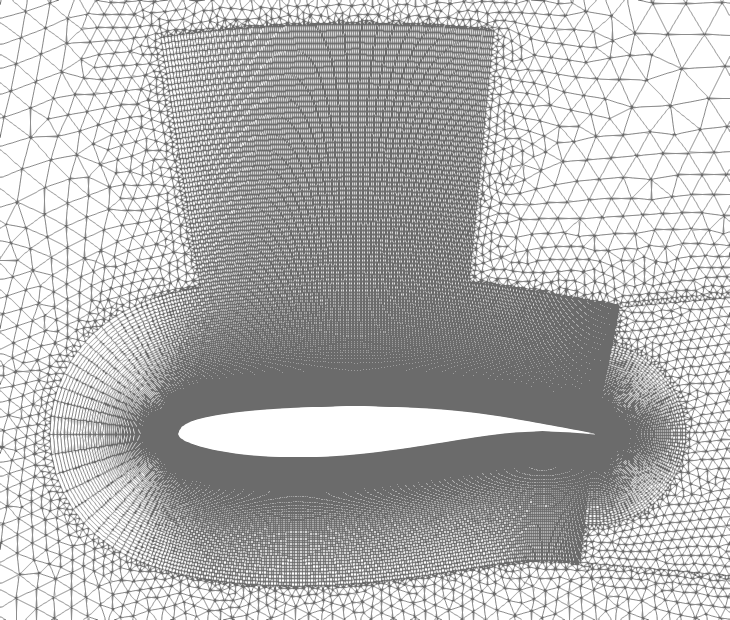
  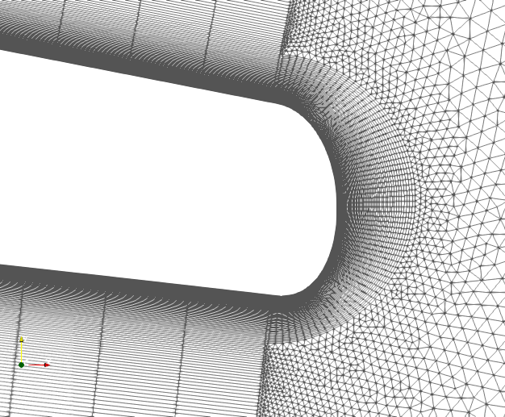
</p>

The mesh settings used to generate this mesh are provided in the default "mesh_config.yaml" file.

## Dependencies

Setting up a suitable Python environment:
```
python3 -m venv aero
source aero/bin/activate
pip install -U pip
pip install -r requirements.txt
```
The OAT15A airfoil contour data can be downloaded [here](https://aiaa-dpw.larc.nasa.gov/geometry.html).

## How to run

To generate the mesh, run:
```
source aero/bin/activate
python main.py mesh_config.yaml

```
Mesh parameters can be adjusted in "mesh_config.yaml" file.

This generates a 2D mesh in obj format. The mesh can be extruded and converted to OpenFOAM format with boundary conditions included, using
```
cd openFOAM_mesh
cp ../mesh.obj .
./Allrun
```

Replace the mesh file name as required.

## Parameter variation

1. weight_upper - Increases the number of mesh nodes distributed to the suction side of airfoil
<table align="center">
  <tr>
    <td align="center">
      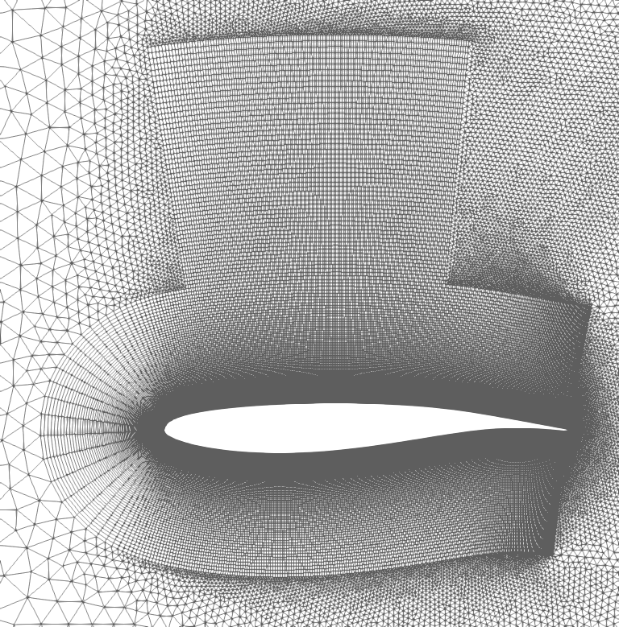<br>
      <em>(a) weight_upper = 1</em>
    </td>
    <td align="center">
      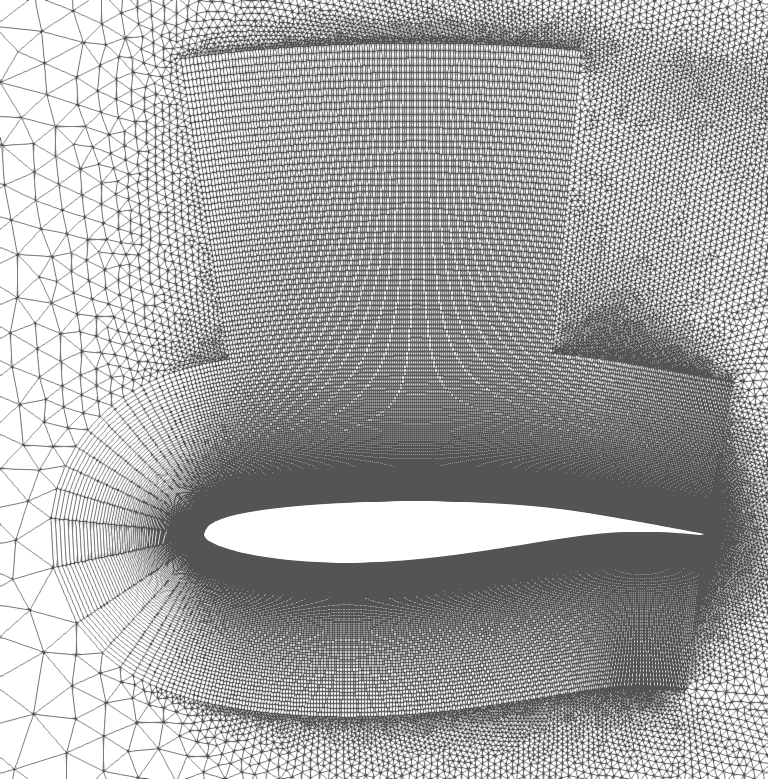<br>
      <em>(b) weight_upper = 4</em>
    </td>
  </tr>
</table>
It is observed that the horizontal mesh length of one of the elements in the buffet zone reduces from 0.00924 to 0.0085. Further improvements can be made by allocating less points in the trailing edge using "weight_te".

2. weight_curvature - Increases the distibution of points where the curvature is high i.e. Nose of the airfoil. 
<table align="center">
  <tr>
    <td align="center">
      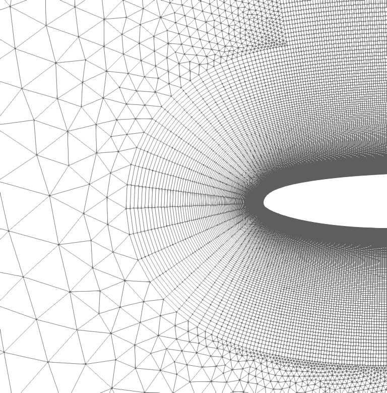<br>
      <em>(a) weight_curvature = 4</em>
    </td>
    <td align="center">
      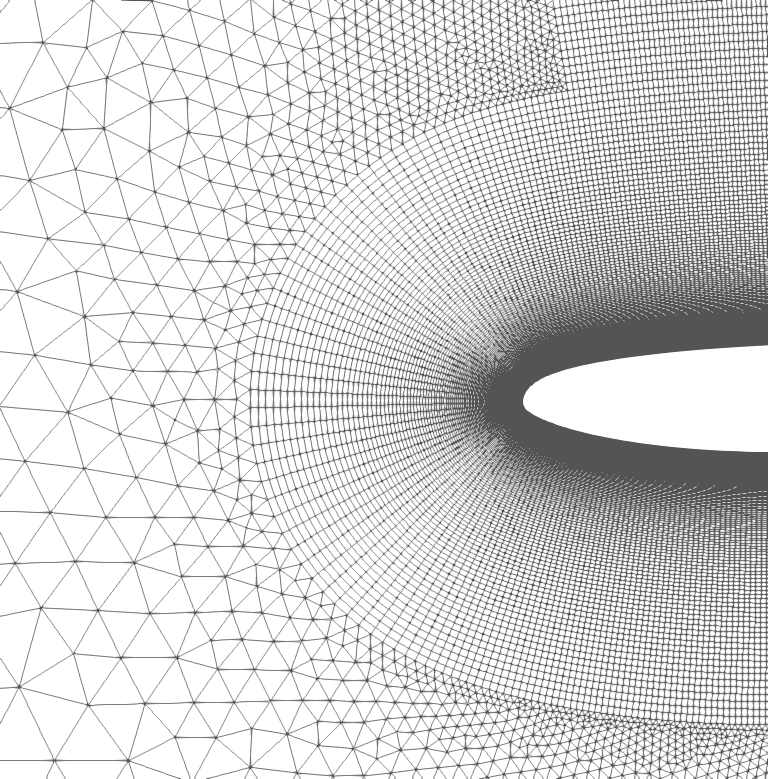<br>
      <em>(b) weight_curvature = 10</em>
    </td>
  </tr>
</table>

Note: It is observed when two different weights at the same time, the sensitivites of different weights are different. Sometime a weight needs to be changes with orders of magnitude to notice any difference. This was observed when simultaenously changing "weight_upper" and "weight_curvature", a weight_curvature = 100 was required to see additonal point sin the nose when increasing the "weight_upper".

3. weight_te - Increases points distribution towards the trailing edge region.
<table align="center">
  <tr>
    <td align="center">
      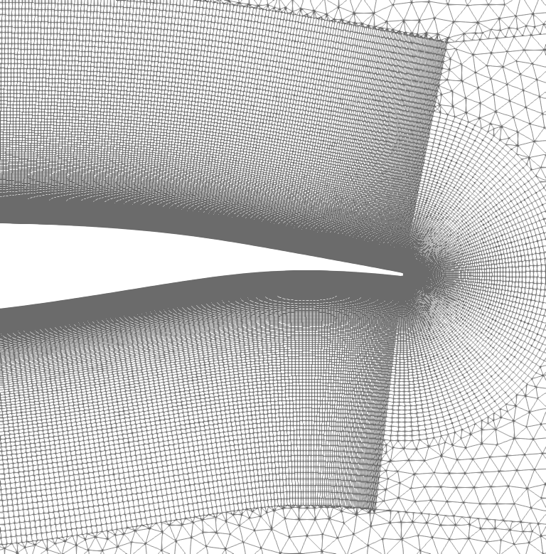<br>
      <em>(a) weight_te = 4</em>
    </td>
    <td align="center">
      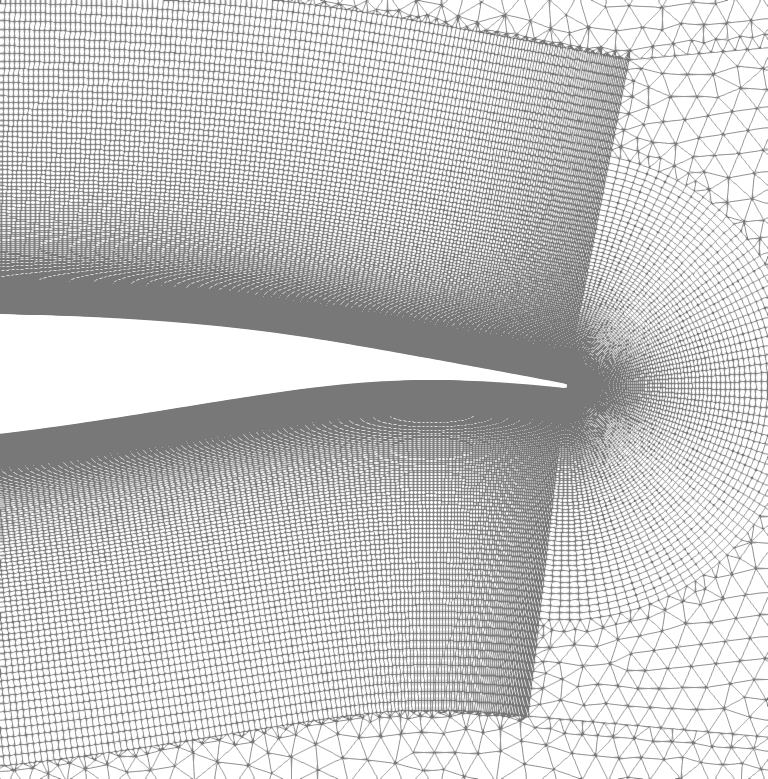<br>
      <em>(b) weight_te = 10</em>
    </td>
  </tr>
</table>
The trailing edge region where this bias is applied is controlled using "fraction_te".

4. shock box dimensions - Controls the dimensions of the structured mesh region where shock buffet is expected to happen.
<table align="center">
  <tr>
    <td align="center">
      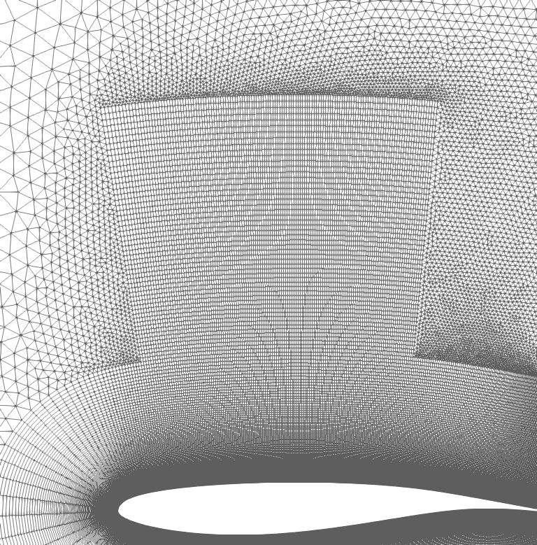<br>
      <em>(a) xmin = 0.05, xmax = 0.7, height = 0.6</em>
    </td>
    <td align="center">
      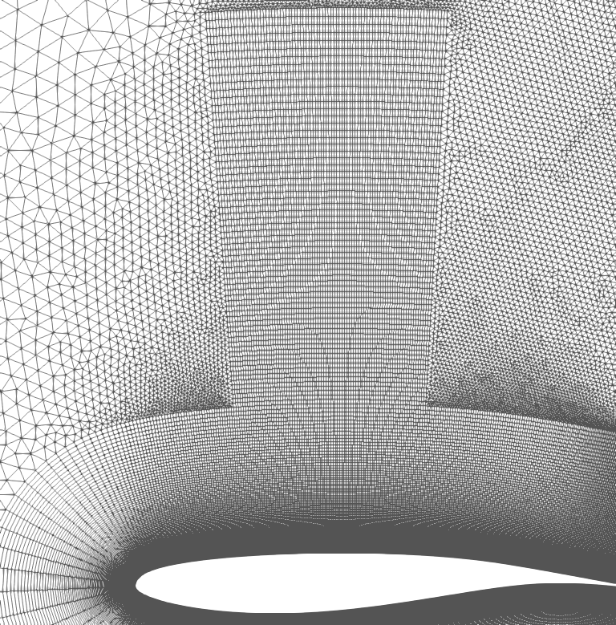<br>
      <em>(b) xmin = 0.2, xmax = 0.6, height = 0.8</em>
    </td>
  </tr>
</table>

5. n_points (wake_tunnel) - Controls number of points used to make the boundary at the trailing edge.
<table align="center">
  <tr>
    <td align="center">
      <br>
      <em>(a) n_points = 70</em>
    </td>
    <td align="center">
      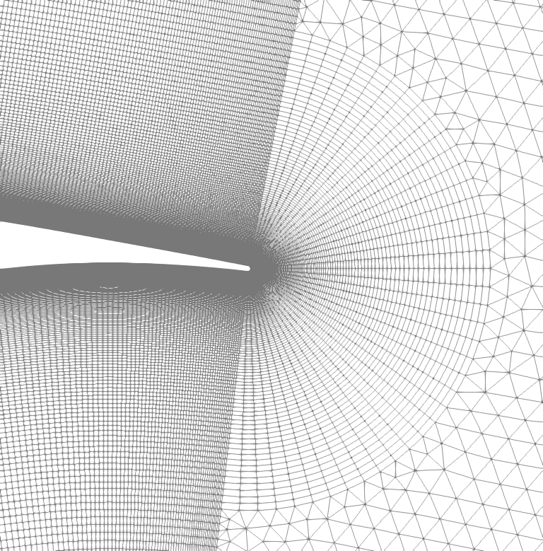<br>
      <em>(b) n_points = 40</em>
    </td>
  </tr>
</table>

6. make_curve (wake) - Provides option to enable or disable to make the trailing edge curved. 
<table align="center">
  <tr>
    <td align="center">
      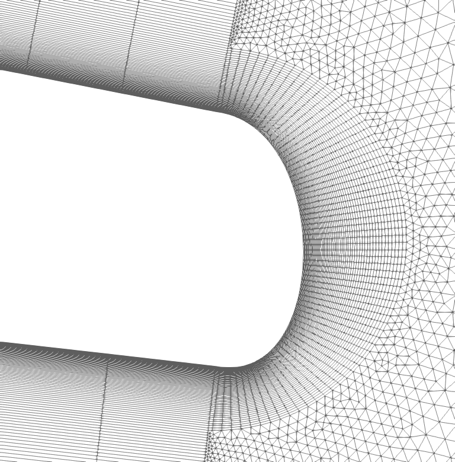<br>
      <em>(a) make_curve = True</em>
    </td>
    <td align="center">
      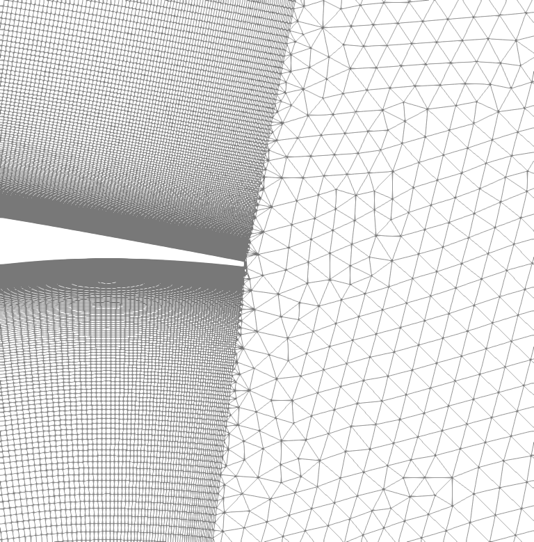<br>
      <em>(b) make_curve = False</em>
    </td>
  </tr>
</table>

7. wake region dimensions - Controls the region of refinement in the wake region (trapezium-shaped).
<table align="center">
  <tr>
    <td align="center">
      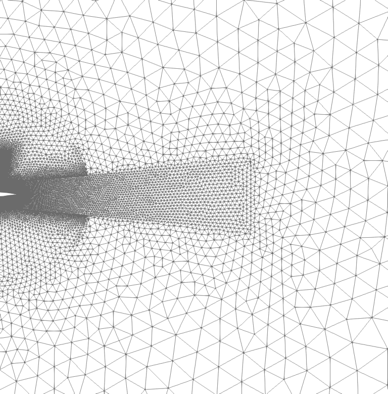<br>
      <em>(a) length = 5, angle = 5 deg</em>
    </td>
    <td align="center">
      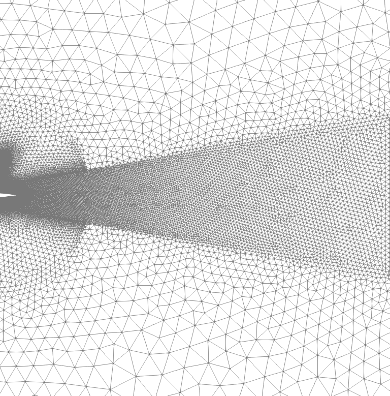<br>
      <em>(b) length = 8, angle = 10 deg</em>
    </td>
  </tr>
</table>

8. wake region mesh size - Controls the triangular element size in the wake region.
<table align="center">
  <tr>
    <td align="center">
      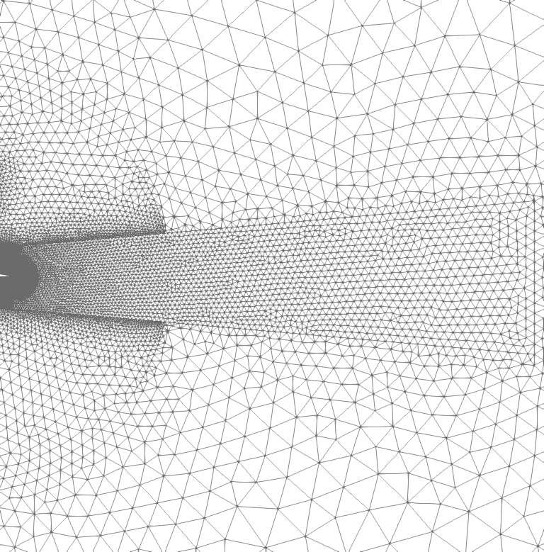<br>
      <em>(a) wake_size = 0.02</em>
    </td>
    <td align="center">
      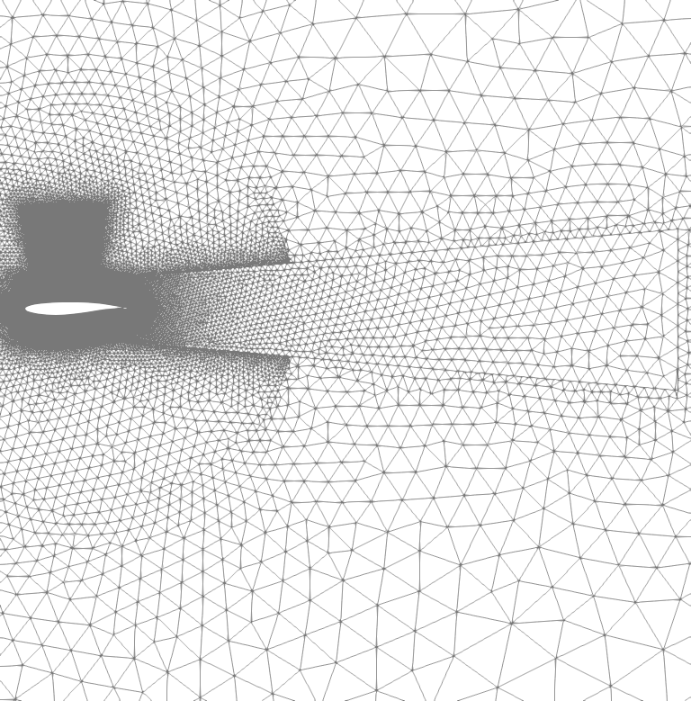<br>
      <em>(b) wake_size = 0.01</em>
    </td>
  </tr>
</table>
Notes: No. of elements for wake_size = 0.02 is 222,346 and for wake_size = 0.01 is 354,396.

9. Farfield mesh size - Controls the mesh sizing for filling remaining region.
<table align="center">
  <tr>
    <td align="center">
      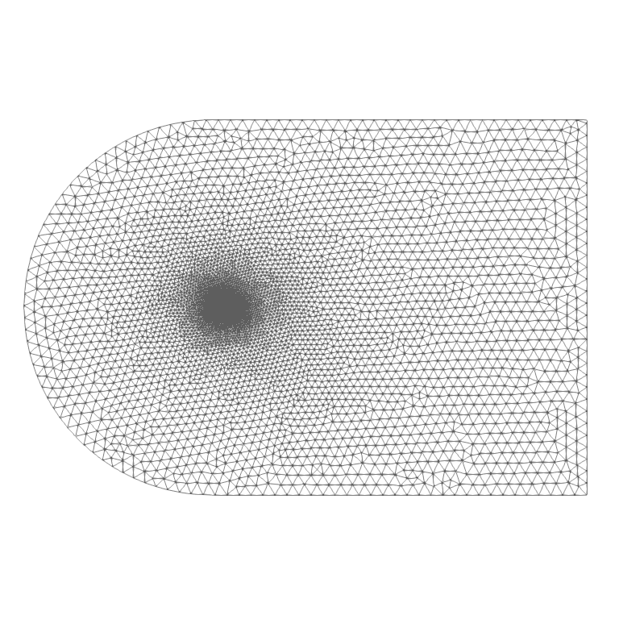<br>
      <em>(a) min_size = 0.02, max_size = 3.2</em>
    </td>
    <td align="center">
      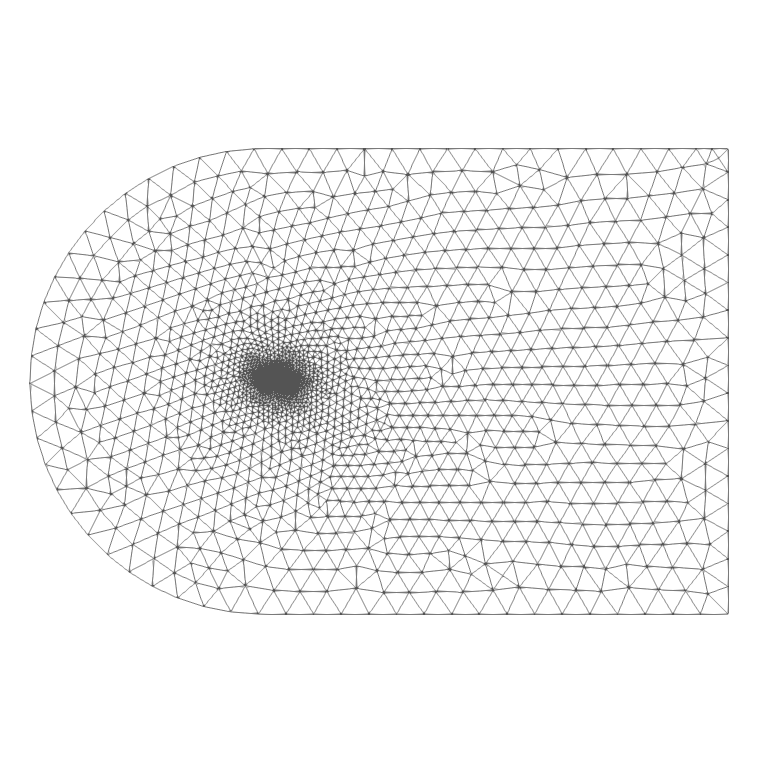<br>
      <em>(b) min_size = 0.02, max_size = 6</em>
    </td>
  </tr>
</table>

10. Fafield mesh grading - Seems to have no effect, more investigation required. 

