# 2D C-Type Airfoil Mesh Generation

This project focuses on the generation of high-quality 2D C-type meshes for airfoil geometries, starting from a given airfoil contour and using as few user-defined parameters as possible. The generated meshes are designed such that a depth-extruded version is suitable for Delayed Detached Eddy Simulation (DDES) ([meshing guideline](https://www.aiaa-dpw.org/ref/gridding_guidelines_v3_07012024.pdf)).

**Background and Reference**:

- [pyAero](https://github.com/chiefenne/PyAero) was evaluated as a reference package. Although it implements many of the required features, initial tests revealed the following issues:
  - loading the contour data is not very robust,
  - the implementation cannot deal with contours that already come with a trailing edge,
  - the contour refinement is not smooth enough for DDES-type simulations; the algorithm introduces 1.5-ratio jumps in the cell edge length along the contour.

The current implementation addresses the above limitations through the following:

- Handling blunt trailing-edge contours by replacing the trailing edge with a smooth curve.
- A smooth point-distribution algorithm for the airfoil surface based on:
  - mesh-size ratio,
  - weighting functions to concentrate mesh points in regions of interest, such as the leading edge or shock-buffet regions.

**Mesh topology**:

The mesh is generated using a hybrid structured–unstructured strategy:

- Structured mesh blocks are created in critical regions:
  - the airfoil boundary layer,
  - the expected shock-buffet region.
- The remaining domain is filled with **unstructured triangular or quad-dominant elements**, generated using the [Gmsh](https://github.com/live-clones/gmsh/tree/master) library.

The unstructured farfield mesh also includes a circular refinement region around the airfoil, allowing finer resolution near the airfoil and surrounding structured blocks before smoothly transitioning to the coarser outer farfield mesh. Options are provided to make the wake region finer.

<p align="center">
  
</p>

<p align="center">
  
</p>

<p align="center">
  
  
</p>

The mesh settings used to generate this mesh are provided in the default `mesh_config.yaml` file.

## Dependencies

To clone the repository:

```bash
git clone https://github.com/tanujravi/airfoil_meshing.git
cd airfoil_meshing
```

Setting up a suitable Python environment:

```bash
python3 -m venv aero
source aero/bin/activate
pip install -U pip
pip install -r requirements.txt
```

The OAT15A airfoil contour data can be downloaded [here](https://www.aiaa-dpw.org/geometry.html).

## How to run

To generate the mesh, run:

```bash
source aero/bin/activate
python main.py mesh_config.yaml
```

Mesh parameters can be adjusted in the `mesh_config.yaml` file.

This generates a 2D mesh in OBJ format. The mesh can be extruded and converted to OpenFOAM format with boundary conditions included, using:

```bash
cd openFOAM_mesh
cp ../mesh.obj .
./Allrun
```

Replace the mesh file name as required.

## Parameter variation

### 1. `n_points` (`airfoil_boundary`)

Increases the number of mesh points allocated to the surface of the airfoil contour.

<table align="center">
  <tr>
    <td align="center">
      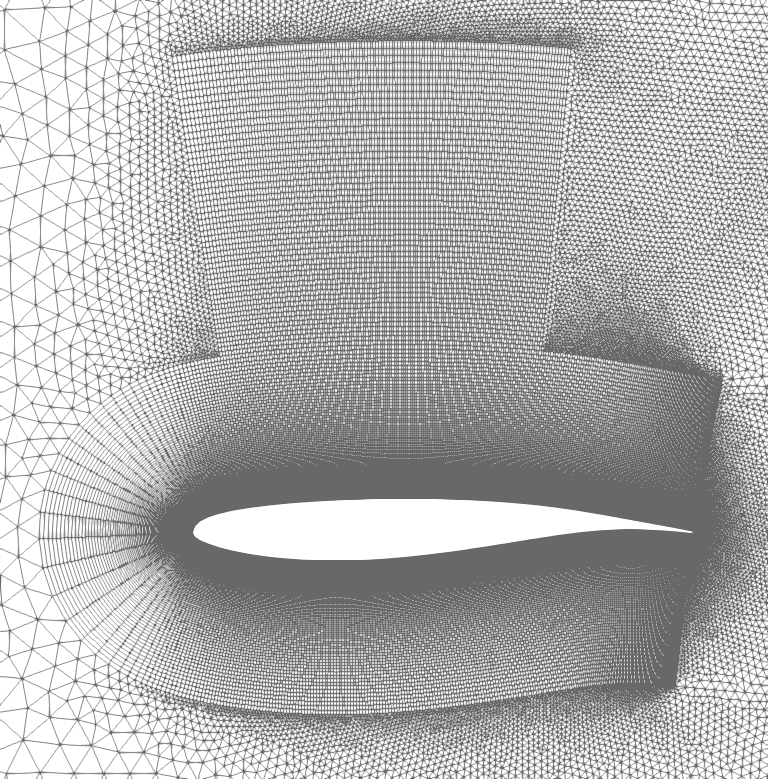<br>
      <em>(a) n_points = 500</em>
    </td>
    <td align="center">
      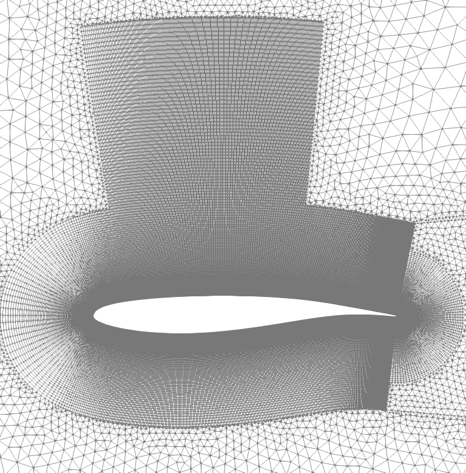<br>
      <em>(b) n_points = 700</em>
    </td>
  </tr>
</table>

### 2. `weight_upper`

Increases the number of mesh nodes distributed to the suction side of the airfoil.

<table align="center">
  <tr>
    <td align="center">
      <br>
      <em>(a) weight_upper = 2</em>
    </td>
    <td align="center">
      <br>
      <em>(b) weight_upper = 4</em>
    </td>
  </tr>
</table>

Note: Further refinement can be achieved by allocating fewer points in the trailing-edge region using the `weight_te` parameter, so that more points are distributed in the buffet zone.

### 3. `weight_curvature`

Increases the distribution of points where the curvature is high, i.e., near the nose of the airfoil.

<table align="center">
  <tr>
    <td align="center">
      <br>
      <em>(a) weight_curvature = 6</em>
    </td>
    <td align="center">
      <br>
      <em>(b) weight_curvature = 10</em>
    </td>
  </tr>
</table>

Note: When multiple weighting functions are applied simultaneously, their sensitivities can differ significantly.

### 4. `weight_te`

Increases point distribution towards the trailing-edge region.

<table align="center">
  <tr>
    <td align="center">
      <br>
      <em>(a) weight_te = 4</em>
    </td>
    <td align="center">
      <br>
      <em>(b) weight_te = 10</em>
    </td>
  </tr>
</table>

The trailing-edge region where this bias is applied is controlled using `fraction_te`.

### 5. Airfoil boundary-layer dimensions

Controls the dimensions of the airfoil boundary layer, namely the first-layer thickness `cell_thickness` (t), the growth ratio `growth` (r), and the extrusion length `extrusion_distance` (L).

<table align="center">
  <tr>
    <td align="center">
      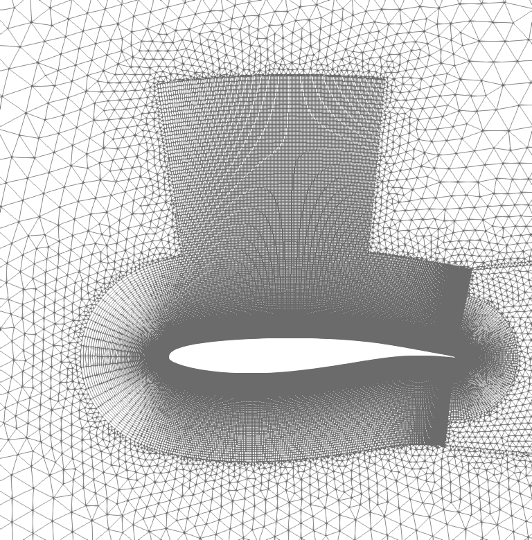<br>
      <em>(a) t = 1e-5, r = 1.03, L = 0.3</em>
    </td>
    <td align="center">
      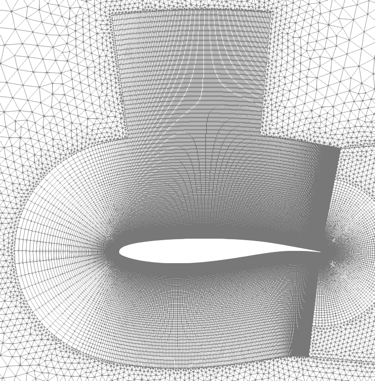<br>
      <em>(b) t = 2e-5, r = 1.04, L = 0.5</em>
    </td>
  </tr>
</table>

### 6. Shock-box dimensions

Controls the dimensions of the structured mesh region where shock buffet is expected to occur.

<table align="center">
  <tr>
    <td align="center">
      <br>
      <em>(a) xmin = 0.05, xmax = 0.7, height = 0.6</em>
    </td>
    <td align="center">
      <br>
      <em>(b) xmin = 0.2, xmax = 0.6, height = 0.8</em>
    </td>
  </tr>
</table>

### 7. `n_points` (`wake_tunnel`)

Controls the number of points used to create the boundary at the trailing edge.

<table align="center">
  <tr>
    <td align="center">
      <br>
      <em>(a) n_points = 70</em>
    </td>
    <td align="center">
      <br>
      <em>(b) n_points = 40</em>
    </td>
  </tr>
</table>

### 8. `make_curve` (`wake_tunnel`)

Provides an option to enable or disable a curved trailing edge.

<table align="center">
  <tr>
    <td align="center">
      <br>
      <em>(a) make_curve = True</em>
    </td>
    <td align="center">
      <br>
      <em>(b) make_curve = False</em>
    </td>
  </tr>
</table>

### 9. `fraction_structured`

Specifies the portion of the airfoil trailing-edge region that will be meshed using a structured grid. The value represents the fraction of the structured mesh length measured in the wall-normal direction relative to the total airfoil extrusion length.

<table align="center">
  <tr>
    <td align="center">
      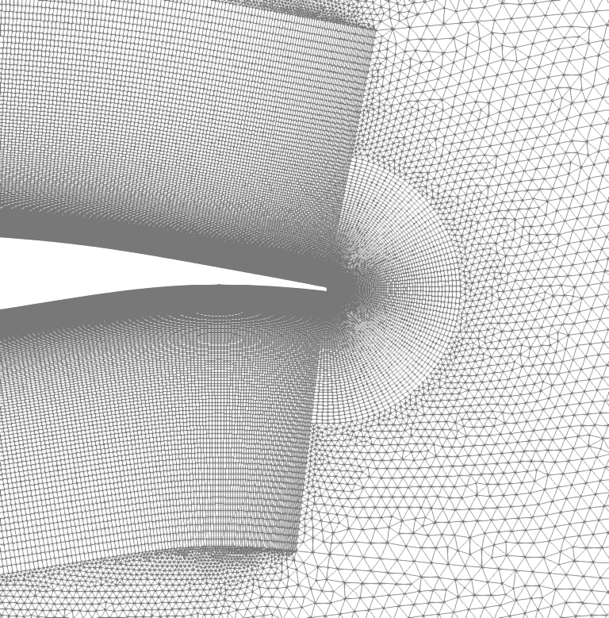<br>
      <em>(a) fraction_structured = 0.7</em>
    </td>
    <td align="center">
      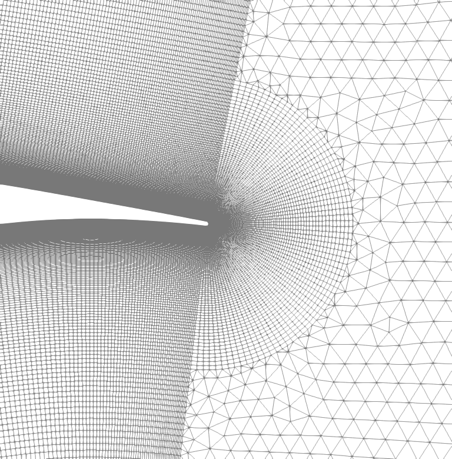<br>
      <em>(b) fraction_structured = 0.5</em>
    </td>
  </tr>
</table>

### 10. Wake-region dimensions

Controls the region of refinement in the trapezium-shaped wake region.

<table align="center">
  <tr>
    <td align="center">
      <br>
      <em>(a) length = 5, angle = 5 deg</em>
    </td>
    <td align="center">
      <br>
      <em>(b) length = 8, angle = 10 deg</em>
    </td>
  </tr>
</table>

### 11. Unstructured mesh `fill_shape`

This parameter controls the type of elements used in the unstructured mesh region. Two options are available:

- `"tria"`: fills the region exclusively with triangular elements.
- `"quad"`: generates a quad-dominant mesh, primarily composed of quadrilateral elements, with a small number of triangles where necessary.

<table align="center">
  <tr>
    <td align="center">
      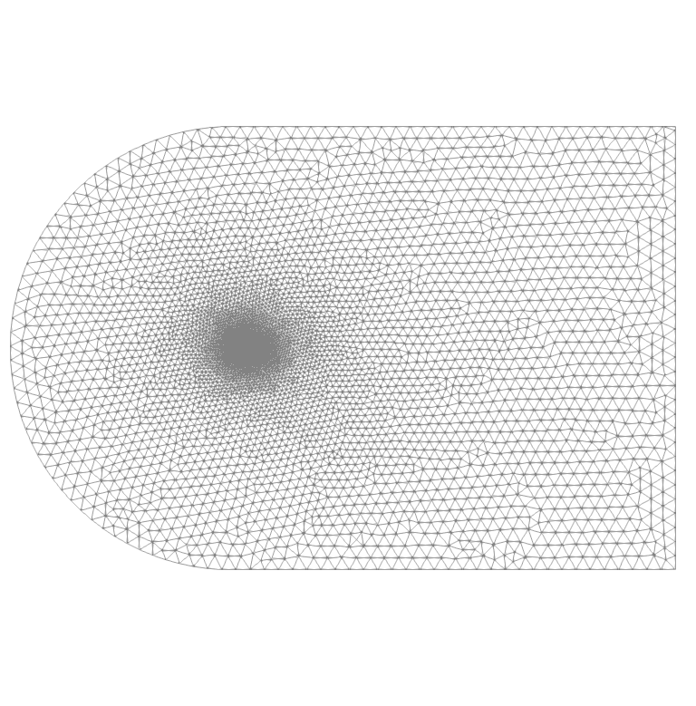<br>
      <em>(a) fill_shape = "tria"</em>
    </td>
    <td align="center">
      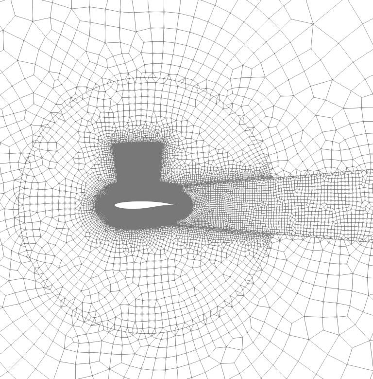<br>
      <em>(b) fill_shape = "quad"</em>
    </td>
  </tr>
</table>

Note: When using `fill_shape = "quad"`, a larger mesh size can typically be employed while maintaining good mesh quality.

### 12. Wake-region mesh size

Controls the element size in the wake region.

<table align="center">
  <tr>
    <td align="center">
      <br>
      <em>(a) wake_size_left = 0.02, wake_size_right = 0.1</em>
    </td>
    <td align="center">
      <br>
      <em>(b) wake_size_left = 0.01, wake_size_right = 0.2</em>
    </td>
  </tr>
</table>

### 13. Circular refinement region

Controls the mesh sizing and grading inside the circular refinement region around the airfoil.

The circular refinement region is used to maintain a finer mesh around the airfoil and nearby structured blocks before transitioning to the outer farfield mesh. The parameters associated with this region are:

- `circle_center`: center of the circular refinement region.
- `circle_radius`: radius of the circular refinement region.
- `inner_size`: mesh size near the inner boundary inside the circular refinement region only.
- `circle_size`: mesh size away from the inner boundary and near the outer edge of the circular refinement region.
- `circle_distmax`: grading distance over which the mesh grows from `inner_size` to `circle_size` inside the circular refinement region.

<table align="center">
  <tr>
    <td align="center">
      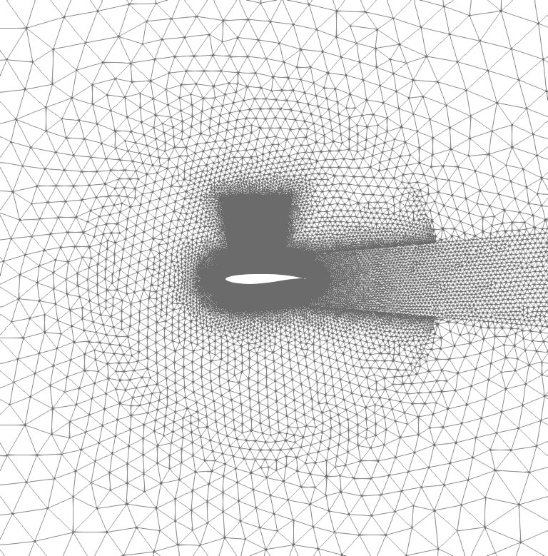<br>
      <em>(a) circle_center = [0.5, 0.0], circle_radius = 2.0, circle_size = 0.12, circle_distmax = 0.7</em>
    </td>
    <td align="center">
      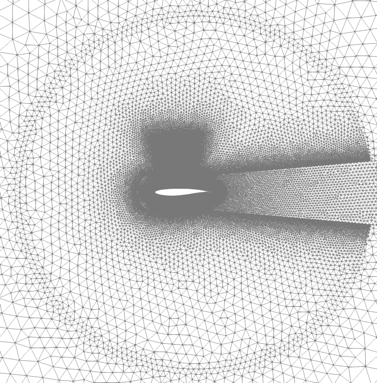<br>
      <em>(b) circle_center = [0.7, 0.0], circle_radius = 3.0, circle_size = 0.18, circle_distmax = 1.7</em>
    </td>
  </tr>
  <tr>
    <td align="center">
      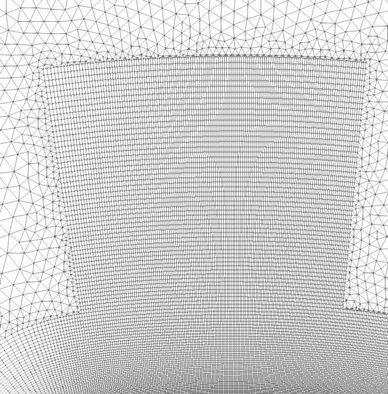<br>
      <em>(c) inner_size = 0.02</em>
    </td>
    <td align="center">
      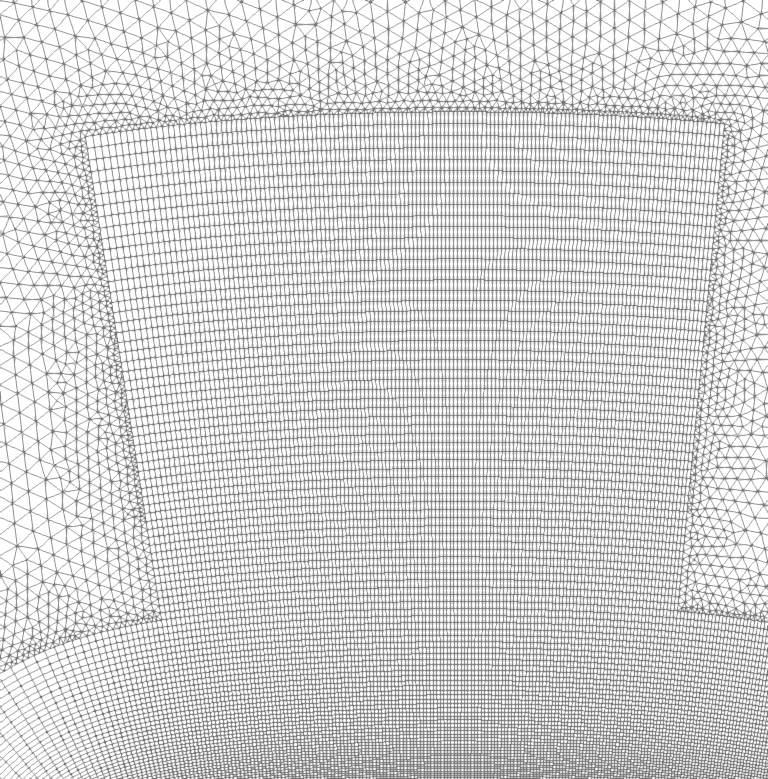<br>
      <em>(d) inner_size = 0.01</em>
    </td>
  </tr>
</table>

Note: The parameter `inner_size` affects only the mesh size near the inner boundary inside the circular refinement region. Outside this circular region, the near-inner-boundary mesh size is controlled by `farfield_start_size`.

### 14. Farfield mesh size

The farfield mesh parameters control how the mesh transitions from the circular refinement region to the outer farfield boundary. The parameters associated with the outer farfield grading are:

- `farfield_start_size`: starting mesh size outside the circular refinement region. This is the mesh size near the circular interface and near the inner boundary outside the circular region.
- `max_size`: maximum mesh size allowed in the outer farfield region.
- `outer_distmax`: grading distance over which the mesh grows from `farfield_start_size` to `max_size` outside the circular refinement region.

In the first comparison, `max_size` and `outer_distmax` are varied together to modify the coarsening rate and final farfield mesh size.

In the second comparison, only `farfield_start_size` is varied while keeping `max_size` and `outer_distmax` fixed.

<table align="center">
  <tr>
    <td align="center">
      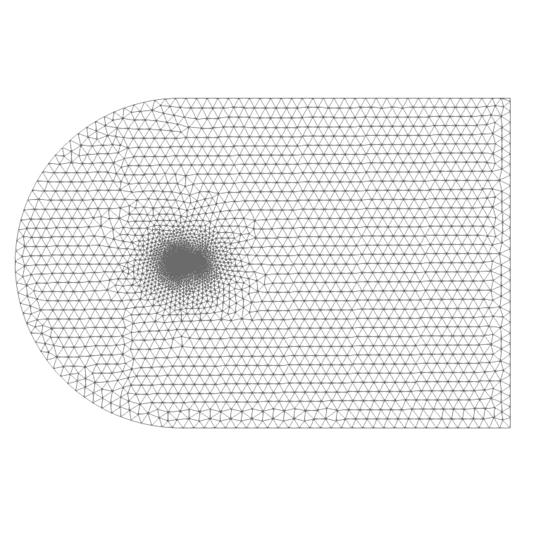<br>
      <em>(a) max_size = 3.2, outer_distmax = 20.0</em>
    </td>
    <td align="center">
      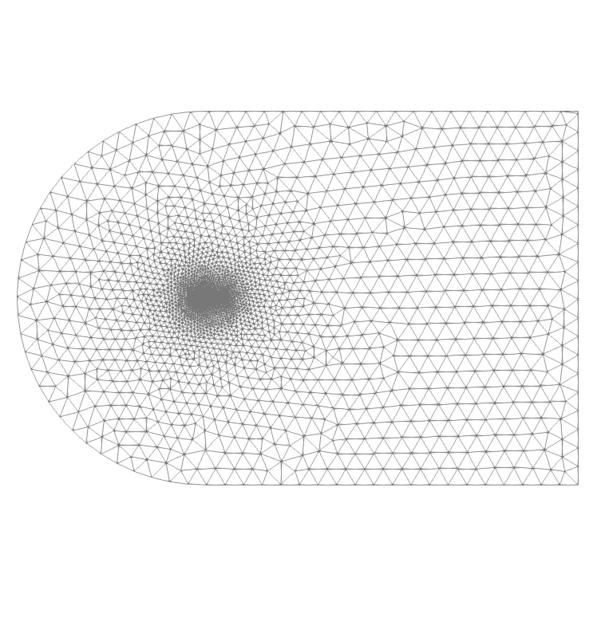<br>
      <em>(b) max_size = 5.0, outer_distmax = 40.0</em>
    </td>
  </tr>
  <tr>
    <td align="center">
      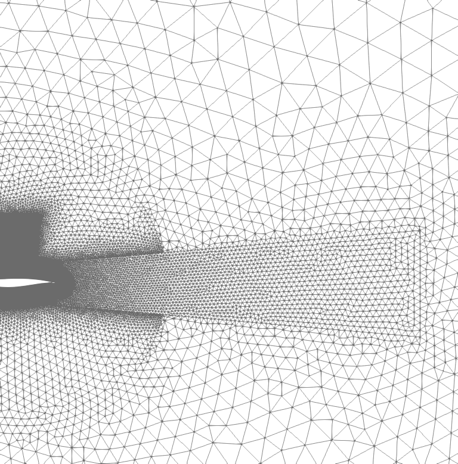<br>
      <em>(c) farfield_start_size = 0.12</em>
    </td>
    <td align="center">
      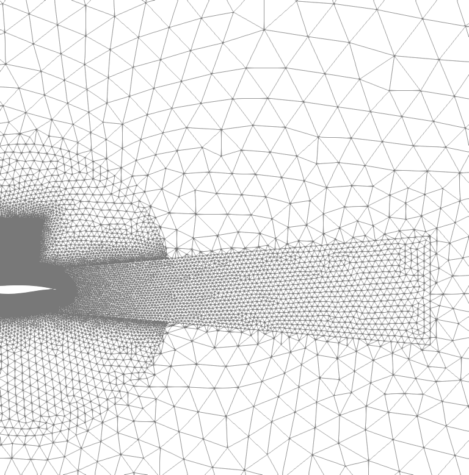<br>
      <em>(d) farfield_start_size = 0.25</em>
    </td>
  </tr>
</table>

Note: `farfield_start_size` controls the mesh size immediately outside the circular refinement region and near the inner boundary in the outer farfield region. The parameters `max_size` and `outer_distmax` control how quickly the mesh grows toward the outer farfield boundary.